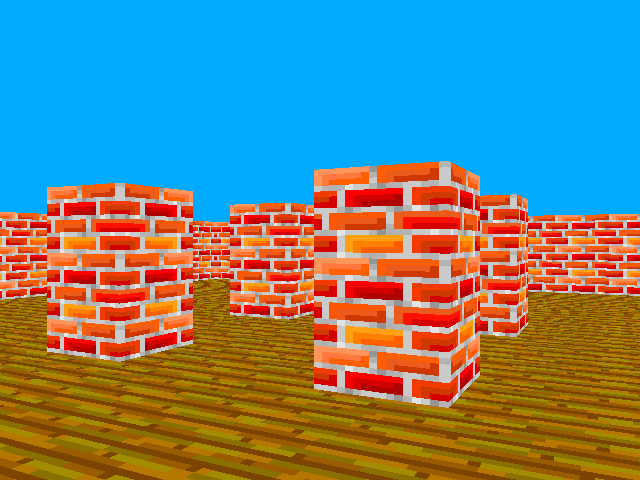

[](https://en.wikipedia.org/wiki/C%2B%2B#Standardization) [](https://github.com/marmakoide/saucats/blob/master/LICENSE)

# reblochon-3d

A silly 3d game engine using mid 90's rendering tech 

* 100% software rendering
* Raycasting on a grid
* Variable heights wall
* Accurate rendering from any point of view, even outside of the map boundaries
* Fixed 256 colors palette

The intention is to have a game engine as convenient as [love2d](https://love2d.org)



Current state: perspective-correct textured walls and floors, variable height walls, editor does not edit anything.

## Getting Started

### Prerequisites

* *reblochon-3d* depends on [SDL2](https://www.libsdl.org), [libpng](http://www.libpng.org/pub/png/libpng.html) and [Eigen library](http://eigen.tuxfamily.org).
* The build system assumes you have Python 2.7 or later installed. 
* *reblochon-3d* compiles with GCC 6 on Linux.

### Build

The build system, [waf](https://waf.io), is part of the source tree. You first 
run the configuration step, that will check that your environment fullfill all 
the requirements for the build

```
./waf configure
```

Then, you can proceed to build

```
./waf
```

### Starting the map editor

For now, you have to start the editor from the main directory

```
./build/reblochon-editor data/test.map 

```

## Using the map editor

At the moment the editor only allows to move around a map, no edit operations
have been implemented yet.

* Left key : rotate view on the left
* Right key : rotate view on the left
* Up key : move forward
* Down key : move backward
* Space bar : move up
* Left shift key : move down
* Escape key : close the editor

The map to edit is passed through the command line

```
./build/reblochon-editor -i data/test.map 

```

If no map is specified, an empty 16x16 map will be created.

By default, the editor runs in windowed mode. You can start in fullscreen mode
as following

```
./build/reblochon-editor --fullscreen -i data/test.map 

```

## Authors

* **Alexandre Devert** - *Initial work* - [marmakoide](https://github.com/marmakoide)

## License

This project is licensed under the MIT License - see the [LICENSE.md](LICENSE.md) file for details


